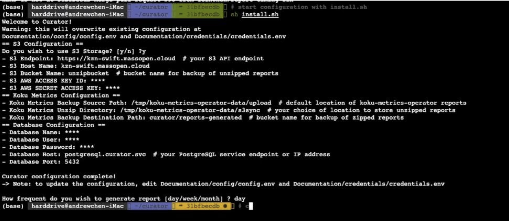
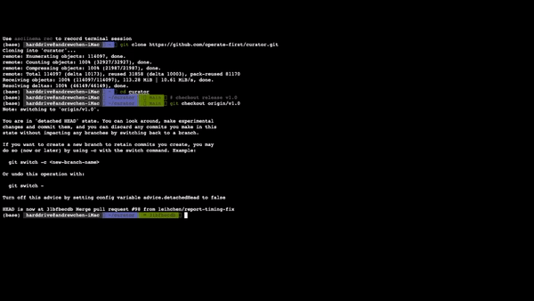

Installation
============

.. _install:

Install Curator
---------------
To install Curator, run ``install.sh``. This will first prompt you to opt-in or opt-out of S3 back-up option and then prompt you to enter the configuration variables needed to run the project.

Here is the screenshot of how terminal should look like - 

.. note::

   At any time you can change the configuration and credentials  by editing 
   ``Documentation/config/config.env`` and ``Documentation/credentials/credentials.env``

If you change the value for variable ``HAS_S3_ACCESS`` later, collected files will be either pushed or not depending on the value for variable. You might lose some earlier data. 

Optionally, you may set:
 * MC_GLOBAL_FLAGS -- flags passed to all invocations of the mc command
 * MC_MIRROR_FLAGS -- flags passed only to the mc mirror command

Deploy Curator
---------------

 Run ``oc apply -k .`` to deploy this application into the namespace defined by the ``namespace:`` setting in ``kustomization.yaml``.

 If you have Kustomize installed separately , run:
	``kustomize build | oc apply -f``

Delete Curator
--------------

 To delete the application from OpenShift, run:
   ``kustomize build | oc delete -f-``

